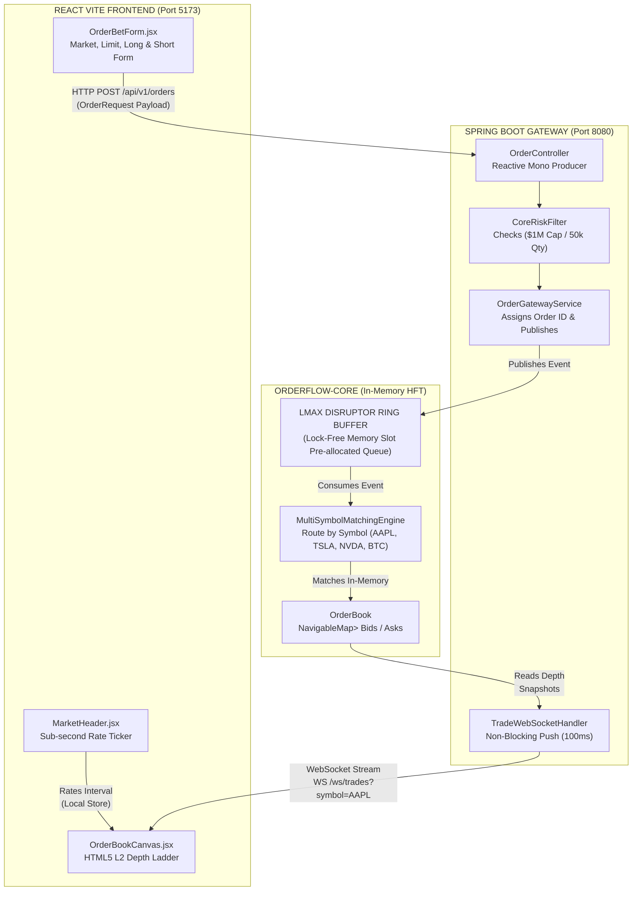
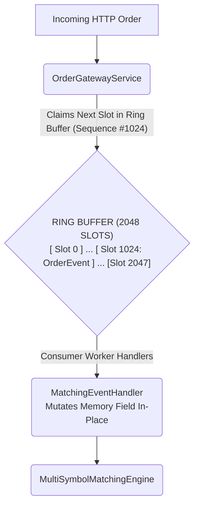

# 🚀 OrderFlow — High-Throughput Matching Engine & Terminal

**OrderFlow** is an ultra-low-latency, event-driven stock matching engine and real-time trading terminal built with Java 21, LMAX Disruptor 4.0, Spring Boot 3 WebFlux, and React 18. It simulates high-frequency trading (HFT) double-auction matching, sub-second L2 market depth visual streams, short-selling execution, and real-time portfolio PnL tracking.

---

## 🏛️ Comprehensive Architecture & Flow Diagrams

### 1. High-Level End-to-End System Topology




[ Incoming HTTP Order ]
             │
             ▼



```text
OFFER / ASKS (SELLERS) ── Sorted Ascending (Lowest Price First)
                  ┌──────────────────────┬──────────────────────┬───────────────┐
                  │      Price ($)       │     Volume (QTY)     │    Orders     │
                  ├──────────────────────┼──────────────────────┼───────────────┤
                  │       $186.00        │         450          │ [Order 4]     │
                  │       $185.80        │         200          │ [Order 3]     │
                  │       $185.50        │         100          │ [Order 1]     │ ◄── BEST ASK
                  └──────────────────────┴──────────────────────┴───────────────┘
─────────────────────────────────────────────────────────────────────────────────────
  SPREAD = $0.50  │  MID MARKET PRICE = $185.25
─────────────────────────────────────────────────────────────────────────────────────
                  ┌──────────────────────┬──────────────────────┬───────────────┐
                  │       $185.00        │         300          │ [Order 2]     │ ◄── BEST BID
                  │       $184.80        │         150          │ [Order 5]     │
                  │       $184.50        │         500          │ [Order 6]     │
                  └──────────────────────┴──────────────────────┴───────────────┘
                  BID / BIDS (BUYERS) ── Sorted Descending (Highest Price First)

  Execution Rule:
  • Aggressive BUY Order @ $185.50 sweeps Best Ask ($185.50) instantly.
  • Unfilled passive volume rests on Best Bid tier.   
```


[ User Action: Click "Sell / Short" 10 Units @ $185.00 ]
                           │
                           ▼
```mermaid
graph TD
    A[User Action: Click "Sell / Short" 10 Units @ $185.00] --> B("Position Stance: SHORT (-10 Qty)<br>Entry Price: $185.00");
    B --> C{Sub-Second Rate Updates};
    C --> D["🟢 Price Drops to $180.00<br><br><b>Short PnL Calculation:</b><br>($185.00 - $180.00) * 10<br>= +$50.00 Profit (GREEN)"];
    C --> E["🔴 Price Rises to $190.00<br><br><b>Short PnL Calculation:</b><br>($185.00 - $190.00) * 10<br>= -$50.00 Loss (RED)"];
    D --> F[User Action: Click "Buy / Cover" 10 Units @ $180.00];
    F --> G("Position Stance: CLOSED (0 Qty)<br>Realized Profit Locked: +$50.00");
```
  
